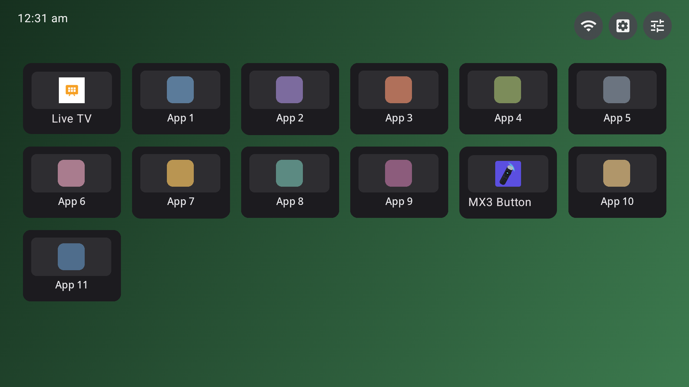
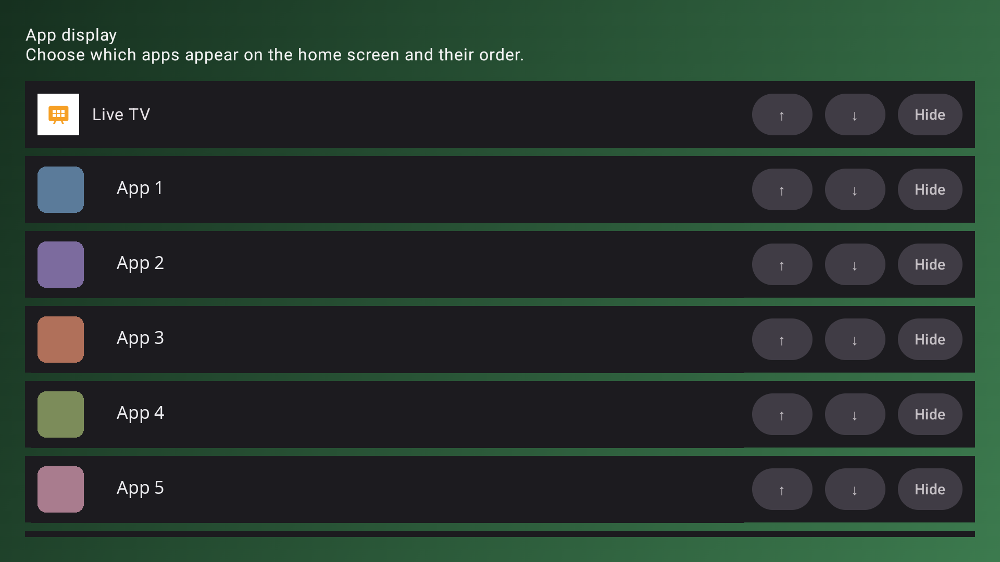
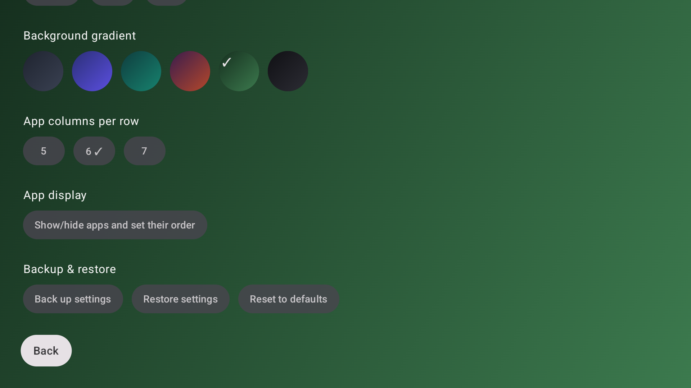

# MX3 Launcher

A minimal Google TV launcher: a flat grid of apps and nothing else.
Built as a lighter alternative to full-featured TV launchers (no
live-TV integration, no content recommendation rows, no search/voice)
for anyone who just wants a fast app grid.

## Features

- **Flat app grid**, 5/6/7 columns (your choice), showing every
  installed launchable app.
- **Top bar**: live clock, a Wi-Fi status icon that jumps straight to
  system network settings, a system settings shortcut, and this app's own
  settings shortcut.
- **Theme**: system / light / dark, with a choice of background gradients.
- **Show/hide and reorder apps** from a dedicated settings screen —
  reordering is move-up/move-down buttons rather than drag-and-drop,
  since drag gestures don't have a sane D-pad equivalent.
- **Left/right wraps around** the edge of a row, so you don't have to
  cross the whole grid one column at a time to get from the first app in
  a row to the last (or back).
- **Press Menu on a focused app icon** to jump straight to that app's own
  system "App info" page (permissions, storage, uninstall) — the usual
  long-press destination on touch launchers, reached here without a
  touch-only gesture.
- **Optional online backup and restore** of your settings via
  sync.odiousapps.com (see [Online services](#online-services)), with
  multiple timestamped backups to pick from when restoring, plus a
  one-tap reset to defaults (which works offline).
- **Optional soundbar wake**: before launching an app, call a URL on
  your own server to wake a soundbar that has dropped into standby (see
  [Online services](#online-services)).
- **Recovers automatically after standby.** If the TV's own built-in
  launcher takes over the screen after waking from standby (which can
  happen if Android frees up the launcher's memory while the screen was
  off), this brings MX3 Launcher back to the front on its own.

## Online services

Both of these are optional and do nothing until you press **Pair** in
Settings and approve the request on another device (scan the QR code or
enter the short code at sync.odiousapps.com, where you sign in to your
account). sync.odiousapps.com is a pairing/backup service run by the
developer. Everything else in the launcher works fully offline.

- **Online backup** — pairing gives the TV a device token. When you
  press *Back up settings*, the TV uploads your theme, background gradient,
  column count, the list of hidden apps and your custom app order to
  sync.odiousapps.com, stored against your account. The hidden-app list
  and app order are **package names of apps installed on the TV**.
  Restoring downloads a chosen backup from the same server. Nothing is
  uploaded unless you press *Back up settings*.

  *Why not local backups?* Earlier versions saved backups to the
  Downloads folder, but that didn't work reliably on TVs: Android/Google
  TV has no Storage Access Framework (SAF) file picker, and files saved
  by another app — or by a previous install or version of this one —
  can't be read back because of Android's file permissions, so backups
  couldn't be restored. Online backup replaced it for that reason.
- **Soundbar wake** — pairing fetches a URL and secret key you saved
  earlier in your sync.odiousapps.com account; they're then stored on the
  TV. Once enabled in Settings, every app launch makes a request to that
  URL (your own server, not sync.odiousapps.com) with `?key=<secret>`,
  plus the IR code name and a `check_current` flag, and waits for it to
  succeed before launching. Which app you're launching is not sent.

  *Server requirement:* the receiving end is
  [`website_lan/send_ir.php`](website_lan/send_ir.php), run on your own
  LAN web server. It needs the
  [MQTTv5Client](https://github.com/evilbunny2008/MQTTv5Client) PHP class
  (expected at `/usr/src/MQTTv5Client/MQTThelper.php`) plus your broker
  details in `/var/www/mqtt-creds.php` to read the smart socket's current
  draw and send the IR command. Without it, soundbar wake won't work.

## Screen Shots

<br>
<br>


## Installing

```
./gradlew assembleDebug
adb install app/build/outputs/apk/debug/app-debug.apk
```

Or open the project in Android Studio and hit Run.

After installing, press Home on the device — Android will prompt you to
choose a launcher (or go to `Settings → Apps → Default apps → Home app`
to switch manually later). Pick MX3 Launcher.

## Settings

Everything customisable lives in the launcher's own Settings screen
(reachable from the gear icon in the top bar): theme, background
gradient, number of columns, and which apps show up and in what order.
Backup, restore, and reset-to-defaults are in the same screen, under
"Backup & restore."

## License

Unlicense (public domain). See `LICENSE`.
